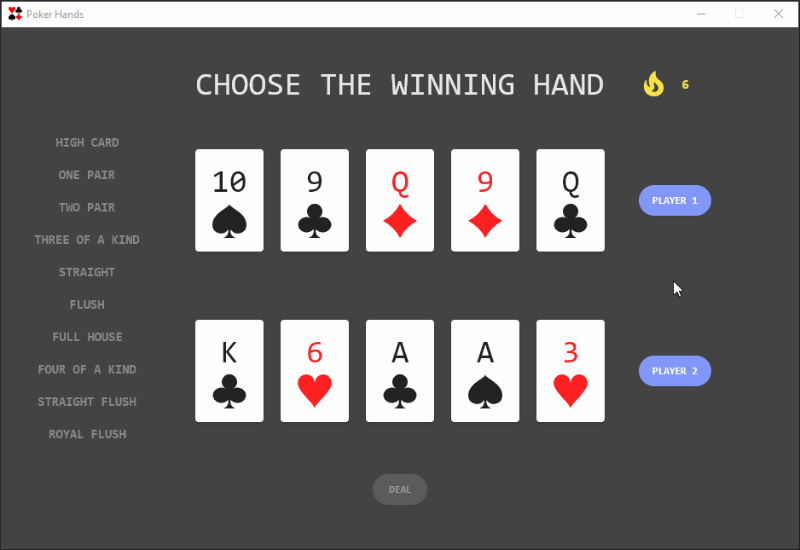

# Poker Hands :rocket: :hearts::clubs::diamonds::spades: :rocket:

Poker hand rankings trainer built with Compose for Desktop. [About?]

### Features

- Minimalist, single window desktop application
- Random generation of valid poker hands from a 52-card deck
- Hot streak tracker, using Animations
- Visual breakdown of the winning rank & any kickers, using State
- Robust model and UI test suites

### Run desktop application

Clone the repository then either:

`./gradlew run` from an open terminal in the root of the project OR

Open the project in IntelliJ IDEA and run `Main.kt` OR

Open the Gradle toolbar and select `poker-hands/Tasks/compose desktop/run`