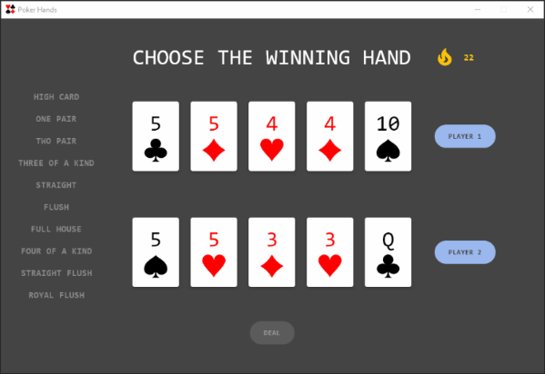

# :rocket: Poker Hands :hearts::clubs::diamonds::spades:

Test your understanding of poker hand rankings with a single window desktop application built
using **JetBrains** [Compose for Desktop](https://www.jetbrains.com/lp/compose-desktop/).

### :memo: Game details

This application is a simplified visual representation of 2 poker hands drawn from a single deck. It does not reflect the 
resulting 5-card combinations (of any hole or community cards) in a typical Texas Hold'em showdown.

If both hands have the same ranking, the rank with the highest numerical value wins. Otherwise, kicker cards are ranked 
to break ties. The ranking of suits is not used to break ties between cards. 

Ace can rank either high (e.g. royal flush) or low (e.g. steel wheel), but not both simultaneously 
(e.g. Q:heart: K:heart: A:heart: 2:heart: 3:heart: is an ace-high flush, not a straight).

Game logic ensures that a pair of hands with an unbreakable tie will not be composed.

### :briefcase: Application features

- Random generation of 2 valid poker hands from a 52-card deck (*k*-combination)
- Ranking algorithm with documented examples
- Visual sequential breakdown of the winning rank (+/- kickers), using State
- Hot streak tracker, using Animations
- Robust model and UI test suites

### :computer: Run desktop application

Clone the repository then either:

`./gradlew run` from an open terminal in the root of the project

OR

Open the project in IntelliJ IDEA and run `Main.kt`

OR

Open the Gradle toolbar and select `poker-hands/Tasks/compose desktop/run`

### :microscope: Run tests

Clone the repository then either:

`./gradlew test` from an open terminal in the root of the project

OR

Open the project in IntelliJ IDEA then choose specific tests using gutter icons or right-click the `src/test` folder and 
select `Run 'Tests in 'poker-hands.test''`

OR

Open the Gradle toolbar and select `poker-hands/Tasks/verification/test`